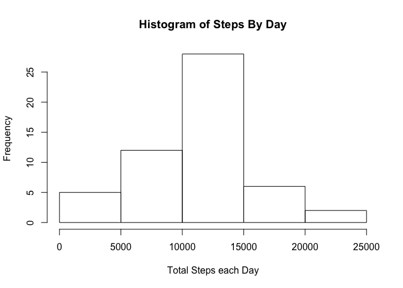

# Reproducible Research: Peer Assessment 1


## Loading and preprocessing the data
Before the data is loaded, it will check if the csv file is present, and if not then it will unzip.


```r
if(!file.exists("activity.csv")){
    unzip("activity.zip")
}
rawdata <- read.csv("activity.csv")
```

## What is mean total number of steps taken per day?

First, a new dataset with the total number of steps taken per day must be created.


```r
daysteps <- aggregate(rawdata$steps, list(rawdata$date), sum)
```

Then, a histogram will be created.


```r
hist(daysteps$x, main = "Histogram of Steps By Day", xlab = "Total Steps each Day")
```

 

Finally, the mean and median of the total number of steps taken per day will be calculated and reported.

Mean:


```r
daystepmean <- mean(daysteps$x, na.rm=TRUE)
print(daystepmean)
```

```
## [1] 10766.19
```

Median:


```r
daystepmedian <- median(daysteps$x, na.rm=TRUE)
```

## What is the average daily activity pattern?


## Imputing missing values


## Are there differences in activity patterns between weekdays and weekends?
