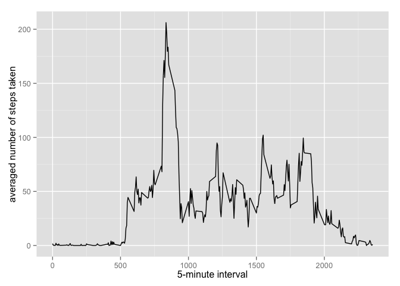

# Reproducible Research: Peer Assessment 1

```r
library(ggplot2)
```

## Loading and preprocessing the data
Before the data is loaded, it will check if the csv file is present, and if not then it will unzip.


```r
if(!file.exists("activity.csv")){
    unzip("activity.zip")
}
rawdata <- read.csv("activity.csv")
```

## What is mean total number of steps taken per day?

First, a new dataset with the total number of steps taken per day must be created.


```r
daysteps <- aggregate(rawdata$steps, list(rawdata$date), sum)
```

Then, a histogram will be created.


```r
hist(daysteps$x, main = "Histogram of Steps By Day", xlab = "Total Steps each Day")
```

 

Finally, the mean and median of the total number of steps taken per day will be calculated and reported.

Mean:


```r
daystepmean <- mean(daysteps$x, na.rm=TRUE)
print(daystepmean)
```

```
## [1] 10766.19
```

Median:


```r
daystepmedian <- median(daysteps$x, na.rm=TRUE)
print(daystepmedian)
```

```
## [1] 10765
```

## What is the average daily activity pattern?

Making a time series plot (i.e. type = "l") of the 5-minute interval (x-axis) and the average number of steps taken, averaged across all days (y-axis).


```r
intervals <- aggregate(x=list(meanstep=rawdata$steps), by=list(interval=rawdata$interval), FUN=mean,na.rm=TRUE)
```


```r
ggplot(data=intervals, aes(x=interval, y=meanstep)) +
    geom_line() +
    xlab("5-minute interval") +
    ylab("averaged number of steps taken") 
```

 

Which 5-minute interval, on average across all the days in the dataset, contains the maximum number of steps?


```r
maxsteps <- which.max(intervals$meanstep)
whichint <- gsub("([0-9]{1,2})([0-9]{2})", "\\1:\\2", intervals[maxsteps,'interval'])
print(whichint)
```

```
## [1] "8:35"
```


## Imputing missing values
Calculating and reporting the total number of missing values in the dataset (i.e. the total number of rows with NAs)


## Are there differences in activity patterns between weekdays and weekends?
